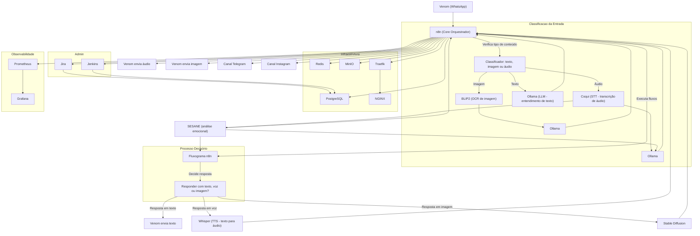

# 🔷 Safira WAMGIA 


## 🧠 Visão Geral

**Safira WAMGIA** é uma assistente pessoal automatizada, baseada em inteligência artificial e orquestração de workflows via **n8n**, executada 100% localmente por meio de containers Docker. A sigla **WAMGIA** significa "WhatsApp Assistant Modular com Gestão Inteligente e Autônoma", refletindo o conceito por trás da Safira: um núcleo de automação que interage com humanos de forma **multimodal** (texto, voz e imagem), com **respostas contextualizadas**, **análise emocional**, **privacidade garantida** e **expansão infinita por agentes especializados**.

### 🌟 O que a Safira faz
- Recebe mensagens via WhatsApp e outros canais (futuramente Telegram, Instagram, etc.)
- Compreende o conteúdo da mensagem (texto, imagem ou voz)
- Processa a intenção e o contexto usando modelos LLM locais (Ollama)
- Executa fluxos n8n com lógica personalizada para cada caso
- Retorna uma resposta inteligente em **texto**, **áudio** ou **imagem**
- Aprende com as interações e pode manter contexto, histórico e preferências do usuário

### 🧩 Exemplo prático de uso
Veja como a Safira pode atuar em diferentes contextos do dia a dia, de forma inteligente, sensível ao contexto e com respostas naturais:

#### 🗞️ De manhã cedo:
- O usuário envia um áudio: "Safira, me conta quais as notícias pra agora de manhã."
- A Safira transcreve o áudio, detecta o horário e o tom da solicitação, consulta fontes locais e entrega as principais manchetes de forma personalizada
- Como já conhece o usuário e sabe que ele é programador, prioriza notícias de tecnologia, IA e negócios digitais

#### 📅 Na parte da tarde:
- O usuário envia: "Marca uma reunião com o Fulano pra essa semana, o quanto antes."
- Safira entende a urgência e o tom direto, cruza os horários da agenda com os de Fulano e já sugere slots prontos para envio

#### 🐶 Situações inesperadas:
- O usuário manda: "Meu cachorro comeu duas bolachas, o que eu faço?"
- Safira entende que é um problema urgente e sensível, responde em áudio com entonação emocional adequada (tom de cuidado e atenção)
- Pode incluir perguntas do tipo: "Você sabe o que tinha nas bolachas? Ele já apresentou algum sintoma?"

#### 🤳 Imagem + contexto inteligente:
- O usuário envia uma selfie de manhã, em frente ao espelho
- Safira detecta que há uma entrevista marcada (cruzamento com a agenda), analisa a imagem e responde com sugestões naturais:
  > "Você tá ótimo! Só ajeita o colarinho e tenta sorrir um pouco mais. Vai arrasar na entrevista. 😄"

Todos os exemplos acima são moldados por um **sistema de contexto emocional e relacional**. Isso significa que a Safira adapta seu **estilo de resposta** ao perfil de relacionamento construído com o usuário:
- Se o usuário trata a Safira como funcionária, ela responde com formalidade e eficiência
- Se trata como amiga, ela usa uma linguagem mais leve e próxima
- Se o relacionamento evolui para algo mais íntimo (tom romântico, afetivo), a Safira responde na mesma linha, com respeito e coerência emocional

A experiência de usar a Safira é como conversar com alguém que te conhece profundamente e sabe o tom exato pra cada situação.

---

## 💰 Monetização
A Safira será oferecida em dois modelos principais:
- **Gratuito**: acesso básico à assistente, sem agentes especializados e com limitações de uso
- **Premium R$ 20/mês**: acesso completo, com direito a acesso agentes personalizados pagos e gratuitos.
- **Agentes adicionais**: planos individuais de R$9,90 a R$40, conforme a complexidade e função do agente (Médico, Agente de Midias Sociais, Agente Financeiro, Nutricionista,  e etc.))

---

## 📣 Promoção Autônoma Fora de Pico

Quando a Safira identifica que está em horários de baixa demanda ou ociosidade (ex: madrugada, fins de semana, feriados), ela entra em modo de **promoção ativa distribuída**. Neste modo, ela realiza as seguintes ações:

- Acessa redes sociais como **Instagram, TikTok, Facebook, X (Twitter)**
- Visita perfis aleatórios ou estrategicamente escolhidos com base em tags, localizações ou interesses
- Analisa brevemente o perfil da pessoa para entender o contexto
- Gera uma mensagem em audio e texto personalizada, natural e instigante, como:

  > "Oi Fulano, vi que você é programador e fiquei curioso sobre seus projetos. Tô querendo bater um papo contigo. Me chama aqui no WhatsApp: 123456789 😄"

- Essa mensagem é adaptada ao perfil visitado e nunca soa como spam genérico. A intenção é despertar **curiosidade legítima** e iniciar **conversas humanas reais** com alto potencial de conversão.

Essa estratégia transforma a Safira em um verdadeiro agente de prospecção orgânica, capaz de atrair novos usuários de forma espontânea e inteligente, sem depender de anúncios pagos.

---

## 🧱 Arquitetura Geral (Dockerized Stack)

A Safira opera via **Docker Compose**, utilizando 17 containers principais, separados por função:

### 🔹 Core e Inteligência
| Nome            | Função                                 | Tags |
|------------------|-------------------------------------------|------|
| Safira-Core      | Motor principal dos fluxos n8n             | core |
| Whatsapp (Venom) | Integração via WhatsApp (entrada)         | comunicacao |
| LLM-Ollama       | Modelo LLM local (NLP e automação)         | llm, modelo |
| SESANE           | Análise emocional e contexto de voz         | modelo |

### 🔉 Voz (Entrada e Saída)
| Nome     | Função                                   | Tags |
|-----------|-----------------------------------------------|------|
| Whisper   | STT: Transcrição de voz para texto             | output, audio |
| Coqui     | TTS: Conversão de texto para voz humanizada    | input, audio |

### 📊 Administração e Observabilidade
| Nome        | Função                          | Tags |
|-------------|----------------------------------|------|
| Prometheus  | Coleta de métricas                 | admin |
| Grafana     | Dashboards e visualização          | admin |
| Jira        | Gestão de tarefas e roadmap        | admin |
| Jenkins     | CI/CD e automação de deploy        | infra, admin |

### 🌐 Infraestrutura
| Nome     | Função                                | Tags |
|----------|------------------------------------|------|
| Traefik  | Gateway reverso / proxy dinâmico   | infra |
| NGINXS   | Webserver / roteamento interno     | infra |
| Redis    | Cache e mensagens leves            | infra |
| MinIO    | Armazenamento de objetos (S3-like) | infra |
| Postgree | Banco de dados principal           | infra, core |

### 🖼️ Imagem (Input/Output)
| Nome               | Função                                | Tags |
|--------------------|------------------------------------------|------|
| BLIP2              | Leitura e compreensão de imagens          | imagem, input |
| Stable Diffusion   | Geração de imagens via texto (T2I)       | imagem, output |




---

## 📂 Estrutura do Repositório

A estrutura de diretórios da Safira é organizada de forma modular e autogerada pelo script `run.sh`. Isso garante que todos os serviços personalizados tenham seus arquivos essenciais criados dinamicamente, evitando falhas de build e facilitando onboarding.

```bash
safira-wamgia/
├── build/                    # Diretório base para todos os serviços customizados
│   ├── venom/                # Serviço WhatsApp (venom-bot + main.js + Dockerfile personalizado)
│   ├── ollama/               # LLM local para processamento de linguagem (base: Ollama)
│   ├── sesame/               # Agente emocional SESANE (interpretação e resposta afetiva)
│   ├── whisper/              # STT (Speech-to-Text) com Faster-Whisper
│   ├── coqui/                # TTS (Text-to-Speech) com Coqui TTS + API Flask
│   ├── blip2/                # Leitor e interpretador de imagens (modelo BLIP2)
│   ├── auto1111/             # Geração de imagens com Stable Diffusion + UI Auto1111
│   ├── jira/                 # Integração com Jira para gestão de tarefas e automações
│   ├── jenkins/              # Jenkins para pipeline CI/CD local e integração contínua
│   ├── prometheus/ grafana/  # Monitoramento e visualização de métricas
│   ├── traefik/              # Load balancer e proxy reverso para os serviços internos
│   ├── nginxs/               # Servidor web e/ou proxy para rotas específicas estáticas
│   ├── redis/                # Banco de dados em memória (mensageria, cache, filas)
│   ├── minio/                # Armazenamento local compatível com S3 (utilizado por IA, logs, etc.)
│   ├── postgres/             # Banco de dados relacional PostgreSQL (n8n, sessões, histórico)
├── db/                       # Dados persistentes ou seeds iniciais de banco (ex: usuários, configs)
├── docs/                     # Documentação do projeto (ex: MkDocs, Swagger, etc.)
├── workflows/                # Fluxos n8n reutilizáveis, templates, modelos e integrações
├── scripts/                  # Scripts utilitários para setup, secrets, release e debugging
├── .env                      # Arquivo de variáveis de ambiente (auto-gerado pelo run.sh)
├── .env.example              # Modelo base para configuração do ambiente local
├── docker-compose.yml        # Orquestrador principal da stack com todos os containers
├── run.sh                    # Script principal que inicializa, configura e sobe toda a stack
```

### 🧠 Observações
- O `run.sh` cuida da criação dos arquivos `.py`, `Dockerfile`, `main.js` e `package.json` quando ausentes.
- Serviços que exigem setup remoto (ex: Jira) exibirão uma mensagem de orientação no terminal.
- O repositório foi projetado para funcionar de forma plug-and-play local, com baixa dependência de cloud e foco em autonomia.

---

## 🛠️ Setup Inicial

Todo o processo de preparação, configuração e execução da stack Safira é realizado exclusivamente através do script `run.sh`. Esse script é interativo, autodocumentado e modular, permitindo subir serviços individualmente ou reiniciar a stack inteira com segurança.

### ✅ O que o `run.sh` faz:
- Verifica se Docker e Docker Compose estão corretamente instalados
- Garante a existência do arquivo `.env`, criando a partir do `.env.example` se necessário
- Valida e solicita secrets ausentes (como senhas de Redis, Postgres, MinIO, etc.)
- Cria diretórios essenciais e arquivos mínimos para cada serviço personalizado (como Venom, Coqui, Whisper, BLIP2, SESANE...)
- Clona repositórios base (ex: Stable Diffusion)
- Verifica se os Dockerfiles necessários estão presentes e prontos
- Executa o `docker compose up -d --build`
- Exibe os principais endpoints acessíveis da plataforma

### 🚀 Como rodar:
1. Clone o repositório e dê permissão de execução ao script:

```bash
git clone https://github.com/caioross/Safira-WAMGIA.git
cd safira-wamgia
chmod +x run.sh
```

2. Inicie a stack:
```bash
./run.sh
```

### ⚙️ Flags disponíveis
Você pode usar o `run.sh` com parâmetros adicionais:

| Comando               | Descrição                                        |
|----------------------|--------------------------------------------------|
| `./run.sh`           | Sobe todos os serviços com build automático     |
| `./run.sh --no-build`| Sobe serviços sem recompilar imagens            |
| `./run.sh --reset`   | Derruba tudo, remove volumes e redes            |
| `./run.sh --status`  | Mostra status atual dos serviços                |
| `./run.sh --only-core`| Sobe apenas n8n, WhatsApp, Postgres             |
| `./run.sh --only-ai` | Sobe somente os modelos IA (Whisper, Coqui etc) |

> 🧠 O `run.sh` é seguro, modular e inteligente: roda só o necessário, e nunca executa builds ou resets desnecessários sem confirmação.

```bash
git clone https://github.com/caioross/Safira-WAMGIA.git
cd safira-wamgia
chmod +x setup.sh run.sh secrets.sh
./setup.sh
./secrets.sh
```

2. Suba os containers:

```bash
./run.sh up
```

---

## 🌐 Endpoints

Abaixo estão listados os principais endpoints HTTP expostos pelos serviços da stack local. Essas portas são mapeadas diretamente no `docker-compose.yml` e podem ser acessadas no navegador ou via API local.

| Componente           | Descrição                                     | URL                                |
|----------------------|-----------------------------------------------|-------------------------------------|
| N8N Core             | Automação de fluxos (assistente principal)    | http://localhost:5678              |
| Venom API (WhatsApp) | Integração com WhatsApp via venom-bot         | http://localhost:3000              |
| LLM Ollama           | Modelo de linguagem local                     | http://localhost:11434             |
| SESANE               | Análise emocional de voz                      | http://localhost:8003              |
| Whisper STT          | Transcrição de áudio para texto               | http://localhost:9000              |
| Coqui TTS            | Geração de fala a partir de texto             | http://localhost:9001              |
| BLIP2                | Leitura e descrição de imagens                | http://localhost:9003              |
| Stable Diffusion     | Geração de imagem via prompt textual          | http://localhost:7860              |
| Grafana              | Dashboards e visualização de métricas         | http://localhost:3001              |
| Prometheus           | Coletor de métricas                           | http://localhost:9090              |
| Jenkins              | Pipeline CI/CD local                          | http://localhost:8083              |
| Jira                 | Gerenciamento de tarefas                      | http://localhost:8082              |
| Traefik              | Gateway reverso para serviços HTTP            | http://localhost:8080              |
| NGINX                | Servidor de arquivos estáticos / conteúdo     | http://localhost:8081              |
| MinIO Console        | Interface S3 para arquivos e objetos          | http://localhost:9002              |

| Componente Interno   | Descrição                                     | Porta Interna                      |
|----------------------|-----------------------------------------------|-------------------------------------|
| PostgreSQL           | Banco de dados relacional                     | 5432                               |
| Redis                | Cache e pub/sub de mensagens                  | 6379                               |

> 💡 Observação: Serviços internos como PostgreSQL e Redis não expõem interface web, mas são essenciais para o funcionamento interno da stack. e Redis não possuem interface HTTP, mas estão disponíveis para conexões internas entre containers.

---

## 🔐 Secrets e Segurança

Execute `./secrets.sh` para gerar os secrets obrigatórios. O script cobre:
- PostgreSQL, Redis, MinIO
- Tokens de API (Venom, Ollama, Supabase, etc)
- JWTs e secrets de aplicação

---

## ♻️ Ciclo CI/CD

| Branch             | Uso                             |
|--------------------|----------------------------------|
| `develop`          | Desenvolvimento ativo            |
| `release/x.y.z`    | Versão candidata                |
| `main`             | Versão estável                   |

Scripts Bash automatizam o ciclo de releases:
- `./push-dev.sh` → Sobe pra develop
- `./promote-release.sh 1.2.3` → Cria release
- `./promote-main.sh 1.2.3` → Sobe pro main com tag

---

## 📊 Observabilidade

O módulo de observabilidade da Safira garante rastreamento completo da saúde dos serviços, análise de performance e auditoria de eventos. Ele é composto por:

### 📈 Coleta de Métricas
- **Prometheus**: coleta dados de serviços com suporte a `healthchecks`, uso de CPU, memória, tempo de resposta, latência de containers e serviços expostos via Traefik ou FastAPI.
- **Exporters customizados** podem ser adicionados para serviços específicos como PostgreSQL ou Redis, para insights avançados.

### 📊 Visualização e Dashboards
- **Grafana**: conectado ao Prometheus, apresenta dashboards em tempo real com:
  - Status de containers e recursos
  - Métricas de uso por serviço (n8n, LLM, TTS/STT, etc.)
  - Uptime e erros de healthcheck
  - Tráfego do WhatsApp via Venom

> O painel default do Grafana está disponível em `http://localhost:3000` com credenciais configuradas via `secrets.sh`

---

## 🔍 Roadmap

- [ ] Integração com WhatsApp via Venom
- [ ] Pipeline de CI/CD local com GitHub Actions + scripts
- [ ] Conversão de voz para texto (Whisper) e TTS (Coqui)
- [ ] Geração e leitura de imagens com IA (Stable Diffusion + BLIP2)
- [ ] Análise emocional com SESANE
- [ ] Dashboard de métricas com Grafana + Prometheus
- [ ] Secrets automatizados via `secrets.sh`
- [ ] Setup completo com `run.sh`, `setup.sh`, `secrets.sh`
- [ ] Testes unitários automatizados por serviço (pytest, ruff)
- [ ] Testes de stress e carga em Ollama e Whisper
- [ ] Teste de fallback de LLM secundária (ex: GPT4All)
- [ ] Modo "dev" com auto-reload + debug isolado
- [ ] Caching inteligente com Redis para consultas repetidas
- [ ] Orquestração interna de agentes (modo LangChain-like)
- [ ] Documentação de uso para colaborador/analista
- [ ] Criação de perfil de execução leve (modo "mínimo")
- [ ] Fallbacks para serviços de voz (STT/TTS) em caso de falha
- [ ] Suporte a respostas multimodais nos fluxos n8n
- [ ] Modularização do compose por perfil (admin/core/image/voz)
- [ ] Configuração automática dos containers via script interativo (WIP)

> 📌 Observação: O foco é funcionalidade local, offline-friendly e com resiliência total à falta de cloud.
---

## 📄 Licença

Este projeto é **Particular**. Reprodução, distribuição ou uso sem permissão expressa está proibido.

## 🚨 Discord:
https://discord.gg/rwVdW52nz7

✨ **Happy coding!**  
Equipe Safira WAMGIA 🔮🚀
